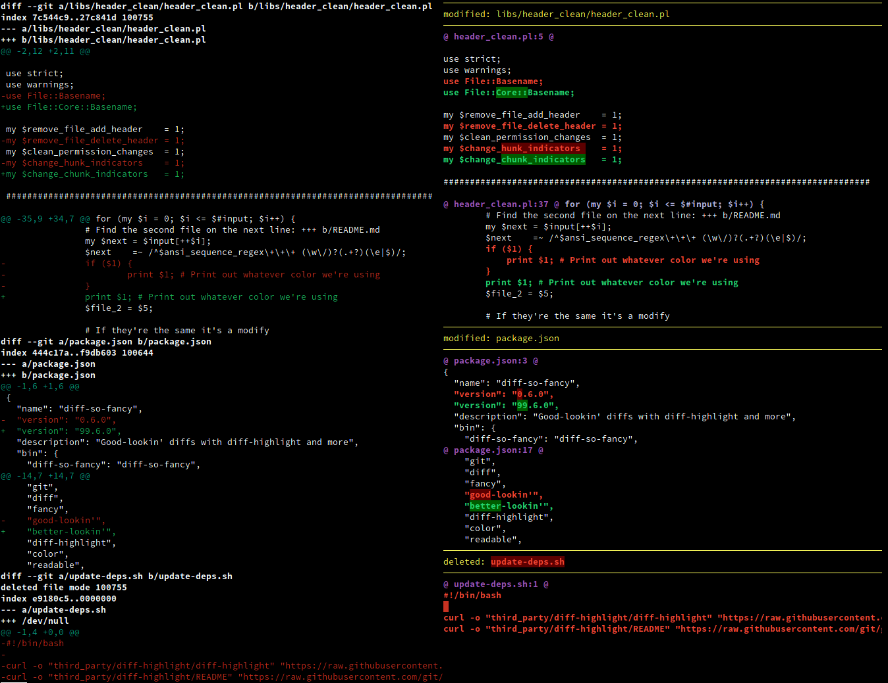

# diff-so-fancy  [](https://circleci.com/gh/so-fancy/diff-so-fancy) [](https://travis-ci.org/so-fancy/diff-so-fancy) [](https://ci.appveyor.com/project/stevemao/diff-so-fancy/branch/master)

`diff-so-fancy` strives to make your diffs **human** readable instead of machine readable. This helps improve code quality and helps you spot defects faster.

## Screenshot

Vanilla `git diff` vs `git` and `diff-so-fancy`



## Install

Simply copy the `diff-so-fancy` script from the latest release into your `$PATH` and you're done. Alternately to test development features you can clone this repo and then put the `diff-so-fancy` script (symlink will work) into your `$PATH`. The `lib/` directory will need to be kept relative to the core script.

If you are using a ZSH framework like [zgenom](https://github.com/jandamm/zgenom) or [oh-my-zsh](https://ohmyz.sh), refer to [Zsh plugin support for diff-so-fancy](pro-tips.md) for detailed installation instructions.

`diff-so-fancy` is also available from the [NPM registry](https://www.npmjs.com/package/diff-so-fancy), [brew](https://formulae.brew.sh/formula/diff-so-fancy), as a package on [Nix](https://github.com/NixOS/nixpkgs/blob/master/pkgs/applications/version-management/diff-so-fancy/default.nix), [Fedora](https://packages.fedoraproject.org/pkgs/diff-so-fancy/diff-so-fancy/), in the [Arch extra repo](https://archlinux.org/packages/extra/any/diff-so-fancy/), and as [ppa:aos for Debian/Ubuntu Linux](https://github.com/aos/dsf-debian).

Issues relating to packaging ('installation does not work', 'version is out of date', etc.) should be directed to those packages' own repositories/issue trackers where applicable.
Issues relating to packaging ("installation does not work", "version is out of date", etc.) should be directed to those packages' repositories/issue trackers where applicable.

**Note:** Windows users may need to install [MinGW](https://sourceforge.net/projects/mingw/files/) or the [Windows subsystem for Linux](https://docs.microsoft.com/en-us/windows/wsl/install-win10).

## Usage

### With git

Configure git to use `diff-so-fancy` for all diff output:

```shell
git config --global core.pager "diff-so-fancy | less --tabs=4 -RF"
git config --global interactive.diffFilter "diff-so-fancy --patch"
```

You can look at the [pro-tips](pro-tips.md#Automatic-fallback) for a more extended configuration that transparently falls back
to default git behaviour if `diff-so-fancy` can't be found.

### Improved colors for the highlighted bits

The default Git colors are not optimal. The colors used for the screenshot above were:

```shell
git config --global color.ui true

git config --global color.diff-highlight.oldNormal    "red bold"
git config --global color.diff-highlight.oldHighlight "red bold 52"
git config --global color.diff-highlight.newNormal    "green bold"
git config --global color.diff-highlight.newHighlight "green bold 22"

git config --global color.diff.meta       "11"
git config --global color.diff.frag       "magenta bold"
git config --global color.diff.func       "146 bold"
git config --global color.diff.commit     "yellow bold"
git config --global color.diff.old        "red bold"
git config --global color.diff.new        "green bold"
git config --global color.diff.whitespace "red reverse"
```

### With diff

Use `-u` with `diff` for unified output, and pipe the output to `diff-so-fancy`:

```shell
diff -u file_a file_b | diff-so-fancy
```

It also supports the recursive mode of diff with `-r` or `--recursive` as **first argument**

```shell
diff -r -u folder_a folder_b | diff-so-fancy
```

```shell
diff --recursive -u folder_a folder_b | diff-so-fancy
```
## Options

### markEmptyLines

Should the first block of an empty line be colored. (Default: true)

```shell
git config --bool --global diff-so-fancy.markEmptyLines false
```

### changeHunkIndicators

Simplify git header chunks to a more human readable format. (Default: true)

```shell
git config --bool --global diff-so-fancy.changeHunkIndicators false
```

### stripLeadingSymbols

Should the pesky `+` or `-` at line-start be removed. (Default: true)

```shell
git config --bool --global diff-so-fancy.stripLeadingSymbols false
```

### useUnicodeRuler

By default, the separator for the file header uses Unicode line-drawing characters.
If this is causing output errors on your terminal, set this to `false` to use
ASCII characters instead. (Default: true)

```shell
git config --bool --global diff-so-fancy.useUnicodeRuler false
```

### rulerWidth

By default, the separator for the file header spans the full width of the terminal.
Use this setting to set the width of the file header manually.

```shell
git config --global diff-so-fancy.rulerWidth 80
```

### hideTopRuler and hideBottomRuler

By default, show both top & bottom horizontal ruler.

```bash
git config --bool --global diff-so-fancy.hideTopRuler    false
git config --bool --global diff-so-fancy.hideBottomRuler false

# __OR__ use the command line options to hide the ruler
diff-so-fancy -U # hide top ruler, -U is short for --no-thr
diff-so-fancy -D # hide bottom ruler, -D is short for --no-bhr

# __OR__ use the command line options to show the ruler
diff-so-fancy -u # show top ruler, -u is short for --show-thr
diff-so-fancy -d # show bottom ruler, -d is short for --show-bhr
```

**NOTE** the priority (show)`-u/-d` > (hide)`-U/-D` > `hideTopRuler/hideBottomRuler`

- if default config to **show**, it is easy to hide it use cmd args of `-U/-D`
- if default config to **hide**, it is easy to show it use cmd args of `-u/-d`

By default, if a ruler is to hide, then it will be replaced by an newline.

- A: if a ruler is going to hide, then make it replaced by an newline
  * This is controled by `-x`, the default is **ON**
- B: if a ruler is to be showing, then make it replaced by an newline
  * This is controled by `-X`, the default is **OFF**

```bash
# -X tells to replace both showing ruler with newline
diff-so-fancy -X        ### both rulers are newline ###
# -X make showing bottom newline, -U make hidding top newline
diff-so-fancy -X -U     ### both rulers are newline ###
# -X make showing top newline, -U make hidding bottom newline
diff-so-fancy -X -D     ### both rulers are newline ###

# -X make showing bottom newline, -U -x make top completely hidding
diff-so-fancy -X -U -x  # no top ruler, bottom ruler newline
diff-so-fancy -x -U     # no top ruler, bottom ruler dash

# -X make showing top newline, -D -x make bottom completely hidding
diff-so-fancy -X -D -x  # no bottom ruler, top ruler newline
diff-so-fancy -x -D     # no bottom ruler, top ruler dash

diff-so-fancy -x -U -D  # completely hide both ruler at all
```

### sectionChar

By default, the section char is set to unicode wide char `◯`, If this is causing
output errors on your terminal, then you can reset it to other char or make it
completely none.

```bash
git config --global diff-so-fancy.sectionChar ""   # set to none
git config --global diff-so-fancy.sectionChar "DIFF" # set to DIFF
# __OR__ use the command line options
diff-so-fancy --use-sc "DIFF" # set to any chars you like
diff-so-fancy -N # none, -N is short for --no-section-char
```

## The diff-so-fancy team

| Person                | Role             |
| --------------------- | ---------------- |
| @scottchiefbaker      | Project lead     |
| @OJFord               | Bug triage       |
| @GenieTim             | Travis OSX fixes |
| @AOS                  | Debian packager  |
| @Stevemao/@Paul Irish | NPM release team |

## Contributing

Pull requests are quite welcome, and should target the [`next` branch](https://github.com/so-fancy/diff-so-fancy/tree/next). We are also looking for any feedback or ideas on how to make `diff-so-fancy` even *fancier*.

### Other documentation

* [Pro-tips on advanced usage](pro-tips.md)
* [Reporting Bugs](reporting-bugs.md)
* [Hacking and Testing](hacking-and-testing.md)
* [History](history.md)

## Alternatives

* [Delta](https://github.com/dandavison/delta)
* [Lazygit](https://github.com/jesseduffield/lazygit) with diff-so-fancy [integration](https://github.com/jesseduffield/lazygit/blob/master/docs/Custom_Pagers.md#diff-so-fancy)

## License

MIT
